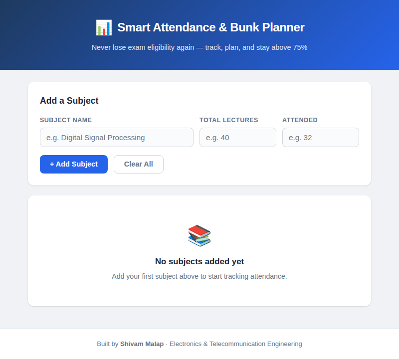
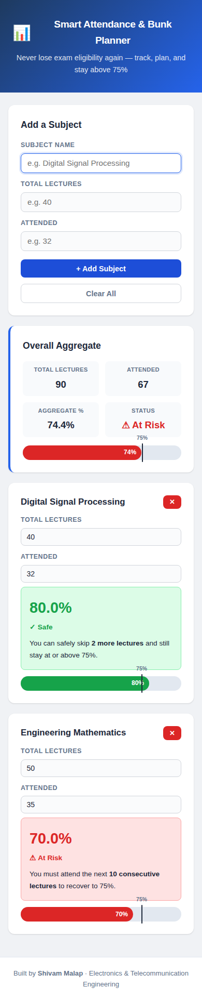

# Smart Attendance & Bunk Planner

> **Suggested repo name:** `smart-attendance-bunk-planner`

A lightweight, browser-based tool that helps engineering students track subject-wise attendance, see how many lectures they can safely skip, and know exactly how many consecutive classes they need to attend to recover to the mandatory 75% threshold. Built as a mini project for Third-Year Electronics & Telecommunication Engineering.

---

## Features

- **Real-time attendance calculation** — instantly shows current percentage per subject
- **Bunk planner** — tells you how many lectures you can safely skip while staying ≥ 75%
- **Recovery calculator** — shows exactly how many consecutive classes you must attend to get back to 75%
- **Subject-wise tracking** — add, edit, or remove subjects independently
- **Aggregate overview** — combined attendance across all subjects at a glance
- **Visual progress bars** — color-coded green (safe) / red (at risk) with a 75% threshold marker
- **Persistent storage** — data is saved in localStorage and survives page reloads
- **Fully responsive** — works on desktop, tablet, and mobile
- **Zero dependencies** — pure HTML, CSS, and JavaScript; no frameworks or build tools

---

## Tech Stack

| Layer     | Technology                        |
|-----------|-----------------------------------|
| Structure | HTML5 (semantic markup)           |
| Styling   | CSS3 (Grid, Flexbox, Variables)   |
| Logic     | Vanilla JavaScript (ES5/ES6)      |
| Fonts     | Google Fonts (Outfit + DM Sans)   |

---

## How to Run

1. **Clone the repository**
   ```bash
   git clone https://github.com/YOUR_USERNAME/smart-attendance-bunk-planner.git
   cd smart-attendance-bunk-planner
   ```

2. **Open in a browser**
   Double-click `index.html` — or right-click → Open With → your browser.
   No server, no build step, no installation needed.

3. **Start tracking**
   Enter a subject name, total lectures, and attended count → click **+ Add Subject**.

---

## Screenshots

> _Replace these placeholders with actual screenshots of your running application._

| Home Screen | Subject Cards | Mobile View |
|-------------|---------------|-------------|
|  |  |  |

---

## Project Structure

```
smart-attendance-bunk-planner/
├── index.html                # Page structure
├── style.css                 # All styling and responsive rules
├── script.js                 # Attendance logic and DOM rendering
├── README.md                 # This file
├── Mini_Project_Report.docx  # College submission report
└── screenshots/              # Add your screenshots here
```

---

## Formulas Used

| Calculation          | Formula                                  |
|----------------------|------------------------------------------|
| Attendance %         | `(attended / total) × 100`               |
| Safe bunks           | `floor(attended − 0.75 × total)`         |
| Lectures to recover  | `ceil(3 × total − 4 × attended)`         |

---

## Git Commands — Quick Start

```bash
# 1. Initialize a new Git repository
git init

# 2. Stage all files
git add .

# 3. First commit
git commit -m "Initial commit: Smart Attendance & Bunk Planner"

# 4. Rename branch to main
git branch -M main

# 5. Add your GitHub remote (replace YOUR_USERNAME)
git remote add origin https://github.com/YOUR_USERNAME/smart-attendance-bunk-planner.git

# 6. Push to GitHub
git push -u origin main
```

---

## Future Improvements

1. **Mobile App** — Port to React Native or Flutter with push notifications for low-attendance alerts.
2. **Login & Cloud Storage** — Add Firebase authentication so data syncs across devices.
3. **Timetable Integration** — Input your weekly timetable and auto-increment lecture counts after each class.
4. **AI-Based Bunk Prediction** — Use historical patterns to suggest the safest days to skip.
5. **PWA Support** — Add a service worker and manifest for offline usage and home-screen install.
6. **PDF Export** — Generate downloadable attendance reports for record-keeping.

---

## Author

**Shivam Malap**
Third Year, Electronics & Telecommunication Engineering

---

## License

This project is open-source and available for educational use.
