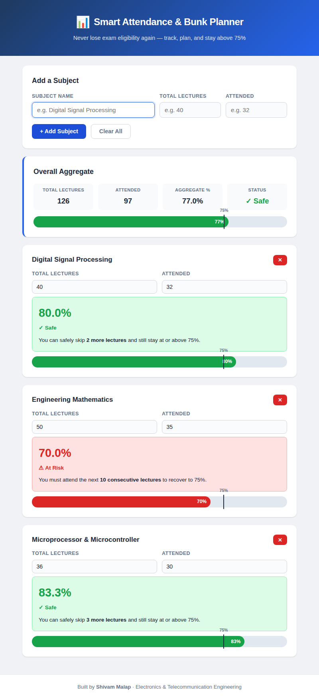

# 📊 Smart Attendance & Bunk Planner

A lightweight, browser-based tool that helps engineering students track their subject-wise attendance, see how many lectures they can safely skip, and know exactly how many classes they need to attend to recover to the mandatory 75% threshold. Built as a mini project for Third-Year Electronics & Telecommunication Engineering.

🔗 **Live Demo:** [https://smalap.github.io/Smart-Attendance-Bunk-Planner/](https://smalap.github.io/Smart-Attendance-Bunk-Planner/)

---

## 🎯 Problem Statement

Engineering students frequently lose exam eligibility by falling below 75% attendance because they have no easy, real-time way to track their attendance or know how many lectures they can safely skip.

---

## ✨ Features

- **Real-time attendance calculation** — instantly shows your current percentage for each subject
- **Bunk planner** — tells you how many more lectures you can safely skip while staying ≥ 75%
- **Recovery calculator** — if you're below 75%, shows exactly how many consecutive classes you must attend to get back
- **Subject-wise tracking** — add as many subjects as you need; edit or remove them anytime
- **Overall aggregate** — see your combined attendance across all subjects at a glance
- **Visual progress bars** — color-coded green (safe) or red (at risk) with a 75% threshold marker
- **Fully responsive** — works on desktop, tablet, and mobile
- **Zero dependencies** — pure HTML, CSS, and JavaScript; no frameworks, no build tools

---

## 🧮 Formulas Used

| Calculation | Formula |
|---|---|
| Attendance % | `(attended / total) × 100` |
| Safe bunks | `floor(attended − 0.75 × total)` |
| Lectures to recover | `ceil(3 × total − 4 × attended)` |

**Recovery formula derivation:**
```
(attended + x) / (total + x) ≥ 0.75
attended + x ≥ 0.75 × total + 0.75 × x
0.25 × x ≥ 0.75 × total − attended
x ≥ 3 × total − 4 × attended
```

---

## 🛠️ Tech Stack

| Layer | Technology |
|---|---|
| Structure | HTML5 |
| Styling | CSS3 (Flexbox, Grid, Custom Properties) |
| Logic | Vanilla JavaScript (ES6) |

---

## 🚀 How to Run

**Option 1 — Use the live demo:**
Visit [https://smalap.github.io/Smart-Attendance-Bunk-Planner/](https://smalap.github.io/Smart-Attendance-Bunk-Planner/)

**Option 2 — Run locally:**

1. Clone the repository
   ```bash
   git clone https://github.com/Smalap/Smart-Attendance-Bunk-Planner.git
   cd Smart-Attendance-Bunk-Planner
   ```

2. Open `index.html` in any browser — no server or installation needed.

3. Add a subject, enter total and attended lectures, and click **+ Add Subject**.

---

## 📁 Project Structure

```
Smart-Attendance-Bunk-Planner/
├── index.html                # Main page structure
├── style.css                 # Styling and responsive design
├── script.js                 # Attendance logic and DOM rendering
├── README.md                 # This file
└── Mini_Project_Report.docx  # College submission report
```

---

## 📸 Screenshots

| Home Screen | Subject Tracking |
|---|---|
|  |  |

> _Replace placeholders above with actual screenshots of your running application._

---

## 🔮 Future Scope

- **Mobile App** — port to React Native or Flutter with push notifications for low-attendance alerts
- **User Login & Cloud Storage** — add Firebase authentication so data persists across devices
- **Timetable Integration** — auto-increment lecture counts based on weekly schedule
- **AI-Based Bunk Prediction** — use attendance patterns to suggest optimal days to skip
- **PWA Support** — add a service worker for offline usage and home-screen installation
- **PDF Export** — generate downloadable attendance reports for record-keeping

---

## 👨‍💻 Author

**Shivam Malap**
Third Year, Electronics & Telecommunication Engineering

- GitHub: [@Smalap](https://github.com/Smalap)

---

## 📄 License

This project is open-source and available for educational use.
